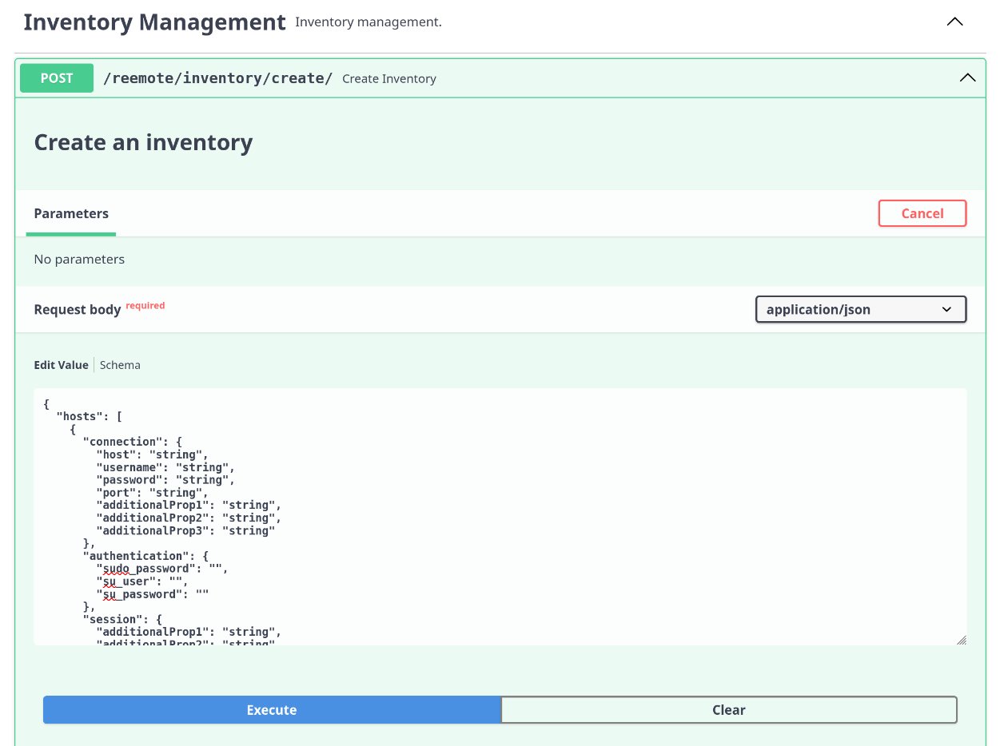

# Inventory

The inventory defines the hosts on which commands or scripts are executed. Its primary role is to organise and manage the hosts you want to automate or configure.

Inventory can be created and managed using both the Reemote Python API and the Reemote REST API.
## Reemote Python API 

The Reemote Python API presents a single operation called `Inventory` to create inventory.
### Declaring an inventory class

This script demonstrate the execution of a shell command on a host and the collection of the results.  The script executes the shell command `echo Hello World!` on all of the hosts in the inventory and prints the response `Hello World!`.  The shell command is executed from user on host `server104`.  The username `user` and password `passsword` are used to connect to the server via SSH.

```python
# examples/declaring_an_inventory_class.py
import asyncio
from reemote.execute import execute
from reemote.core import GetFact
from reemote.inventory import Inventory, InventoryItem, Connection


async def main():
    inventory = Inventory(
        hosts=[
            InventoryItem(
                connection=Connection(
                    host="server104", username="user", password="password"
                ),
            )
        ]
    )

    responses = await execute(
        lambda: GetFact(cmd="echo Hello World!"),
        inventory=inventory,
    )
    for response in responses:
        print(response["value"]["stdout"])


if __name__ == "__main__":
    asyncio.run(main())
```

This program prints `Hello World!` on the console.
		
This inventory consists of a list of `InventoryItem` objects, one for each host.  The inventory object contains a `Connection` object that describes the ssh connection over which commands are sent.

The `InventoryItem` and `Connection` constructors create dictionaries. 
### Declaring an inventory dictionary

Inventory also can be constructed by declaring dictionaries.  The inventory created in the example below is identical to the one created in the example above.

```python
    # examples/declaring_an_inventory_dictionary.py
    inventory = Inventory(
        hosts=[
            {
                "connection": {
                    "host": "server104",
                    "username": "user",
                    "password": "password",
                },
            }
        ]
    )
```

This inventory consists of a list of dictionaries, one for each host.  The dictionary item contains a contains connection key.  The value of this item is a dictionary that describes the ssh connection over which commands are sent.
### Reading inventory from external sources

The inventory dictionary can be serialised to json.  This makes it easy to create applications that read inventory from file.
## Inventory data structure

### Connection inventory element

Reemote makes use of the Asyncssh library to manage ssh connections.  The  `Connection` options are passed to [acyncssh.connect](https://asyncssh.readthedocs.io/en/latest/api.html#asyncssh.connect).  The connection options are documented here: [asyncssh.SSHClientConnectionOptions](https://asyncssh.readthedocs.io/en/latest/api.html#asyncssh.SSHClientConnectionOptions). 
#### Session inventory element

Reemote makes use of the Asyncssh library to manage ssh sessions.  The  `Session` options are passed to [asyncssh.create_session](https://asyncssh.readthedocs.io/en/latest/api.html#asyncssh.SSHClientConnection.create_session).  
#### Authentication inventory element

The authentication inventory element contains the sudo and su authentication options.
#### Groups inventory element

The groups inventory element is used to group hosts by function.  Operations specify a host group to act on.  By default every host is a member of the group `all`.
#### Inventory element example

In the example below, the inventory describes two hosts `server104` and `server104`.  The Connection inventory element describes the ssh connection options.  Both hosts have the ssh username `user` and ssh password `password`. `server104` is in the host group `servers` and `server105` is in the host group `databases`.  The shell command group option specifies group `databases`.  So, the shell command will only be executed on servers in this group.  In this case `server105` is the only member of the group `databases` so the command will only be executed on that host.  The Session inventory element specifies that the terminal type will be set to `xterm` for all ssh sessions with this host.  The Authentication inventory element specifies the sudo password.  The shell command requires sudo, so its sudo option is set to `True`.  When the command is executed the sudo password, from the authentication inventory element, will be used.

```python
# examples/inventory_data_structure.py
import asyncio
from reemote.execute import execute
from reemote.core import GetFact
from reemote.inventory import (
    Inventory,
    InventoryItem,
    Connection,
    Session,
    Authentication,
)


async def main():
    inventory = Inventory(
        hosts=[
            InventoryItem(
                connection=Connection(
                    host="server104", username="user", password="password"
                ),
                groups=["all", "servers"],
            ),
            InventoryItem(
                connection=Connection(
                    host="server105", username="user", password="password"
                ),
                session=Session(term_type="xterm"),
                authentication=Authentication(sudo_password="password"),
                groups=["all", "databases"],
            ),
        ]
    )

    responses = await execute(
        lambda: GetFact(cmd="cat /etc/shadow", sudo=True, group="databases"),
        inventory=inventory,
    )
    for response in responses:
        print(response["value"]["stdout"])


if __name__ == "__main__":
    asyncio.run(main())
```
This prints the content of the `/etc/shadow` file from the host `server105` on the console.
## Using the inventory in scripts

During script execution the remote host's inventory item can be interrogated.
#### Accessing the inventory in an operation

The `Getcontext` method can be used to access the inventory item.  The `inventory_item` field of the returned context contains the inventory item for the remote host.

In the example below, the `Getcontext` response value is used to obtain the user name being used for the ssh connection to the remote host.

```python
    # examples/accessing_the_inventory_in_an_operation.py
    class Root:
        async def execute(self):
            response = yield Getcontext()
            context = response["value"]
            print(context.inventory_item.connection.username)

    await execute(lambda: Root(), inventory=inventory)
```

When supplied with the inventory from the declaring an inventory class example, above, this prints `user` on the console.
#### Accessing the host name or address

The host name or address to connect to is returned as part of the response from every operation.

For example, this code snippet accesses the `host` field of the response object.
```python
    # examples/accessing_the_host_name_or_address.py
    class Root:
        async def execute(self):
            response = yield Shell(cmd="echo Hello World!")
            print(response["host"])

    await execute(lambda: Root(), inventory=inventory)
```

This prints `server104` on the console
#### Accessing the inventory in a callback

The context is passed in the callback parameter.

For example, this code snippet accesses the inventory item in the callback command parameter. 
```python
    # examples/accessing_the_inventory_in_acallback.py
    async def callback(command: Command):
        return command.inventory_item.connection.username

    class Root:
        async def execute(self):
            response = yield Callback(callback=callback)
            print(response["value"])

    await execute(lambda: Root(), inventory=inventory)
```

This prints `user` on the console.
## Reemote REST API 

The Reemote REST API presents end points to create an inventory, get the inventory content, and to add hosts to or delete hosts from the inventory.
### The create endpoint

The Inventory for the REST API can be created using the `reemote/inventory/create` end point.  

For example, this curl command creates an inventory item to access the host `server104`.  Subsequent accesses to the REST API will use this inventory.   

```bash
curl -X 'POST' \
  'http://127.0.0.1:8001/reemote/inventory/create/' \
  -H 'accept: application/json' \
  -H 'Content-Type: application/json' \
  -d '{"hosts" : [
            {
                "connection": {
                    "host": "server104",
                    "username": "user",
                    "password": "password"
                }
            }
        ]
}'
```

The command responds:
```json
{ "error": false, "value": "Inventory created successfully." }
```
### The Swagger UI

The create endpoint can also be accessed using the swagger UI.

For example, navigate to `http://127.0.0.1:8001/docs#/Inventory%20Management/create_inventory_reemote_inventory_create__post` and enter the json to create the inventory.



### Starting the API server with an inventory file

By default, the inventory used by the REST API is stored in the `~/.config/reemote/` directory.  It is completely separate from the program defined inventory used during module execution.

The inventory file can be passed as a parameter to the reemote API server.  

In this example, the absolute path of a file `inventory.json` containing the inventory is passed as a parameter when the server is started.

```bash
cat <<EOF > inventory.json
{"hosts" : [
            {
                "connection": {
                    "host": "server104",
                    "username": "user",
                    "password": "password"
                }
            }
        ]
}
EOF
reemote --inventory=/home/user/inventory.json
```
### The get endpoint

The Inventory for the REST API can be retrieved using the `reemote/inventory/get` end point.  For example, this curl command returns the inventory in json format.
```bash
curl -X 'GET' \ 'http://127.0.0.1:8001/reemote/inventory/get?group=all' \ -H 'accept: application/json'
```

The command responds:

```json
[ { "error": false, "value": { "hosts": [ { "connection": { "host": "server104", "username": "user", "password": "password" }, "authentication": { "sudo_password": "", "su_user": "", "su_password": "" }, "session": {}, "groups": [] } ] } } ]
```
### The delete endpoint

The inventory item for a host can be deleted from the inventory using the end point `reemote/inventory/delete`.  For example, this curl command removes the inventory item for `server104` from the inventory.
```shell
curl -X 'DELETE' \ 'http://127.0.0.1:8001/reemote/inventory/delete/server104' \ -H 'accept: application/json'
```

The command responds:
```json
{ "error": false, "value": "Host deleted successfully: server104" }
```
### The add endpoint

The inventory item for a host can be added to the inventory using the end point `reemote/inventory/add`.  For example, this curl command add the inventory item for `server104` to the inventory.

```shell
curl -X 'POST' \ 'http://127.0.0.1:8001/reemote/inventory/add/' \ -H 'accept: application/json' \ -H 'Content-Type: application/json' \ -d ' { "connection": { "host": "server104", "username": "user", "password": "password" } }'
```

The command responds
```json
{ "error": false, "value": "Host added successfully: server104" }
```