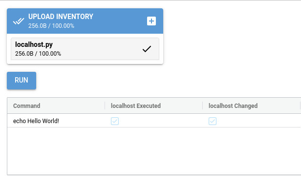

Getting started
===============

Hello World CLI Example
-----------------------

Verify installation
-------------------

We are going to connect to localhost using ssh and then execute a command using Reemote.

Check out the Reemote git repo.

.. code-block:: bash

   git clone git@github.com:kimjarvis/reemote.git
   cd reemote

Modify the file localhost.py to add your user name and your password.  This is an inventory file.
It describes the hosts on which the Reemote command will run.  In this case its localhost.

.. code-block:: bash

    from typing import List, Tuple, Dict, Any

    def inventory() -> List[Tuple[Dict[str, Any], Dict[str, str]]]:
        return [({'host': 'localhost',  # Host
                  'username': 'youruser',  # User name
                  'password': 'yourpassword'  # Password
        },{})]

Now we can now execute a class using the Reemote CLI.

.. code-block:: bash

    reemote --cli -i localhost.py -s examples/hello_world/main.py -c Hello_world

This executes the following class in main.py

.. code-block:: bash

    class Hello_world:
        def execute(self):
            r = yield Shell("echo Hello World!")
            print(r.cp.stdout)

You should see the output of the command and an execution report.

.. code-block:: bash

    > reemote --cli -i localhost.py -s examples/hello_world/main.py -c Hello_world
    Hello World!

    +-------------------+----------------------+---------------------+
    | Command           | localhost Executed   | localhost Changed   |
    +===================+======================+=====================+
    | echo Hello World! | True                 | True                |
    +-------------------+----------------------+---------------------+

Hello World GUI Example
-----------------------

Lets try running that in the GUI.

.. code-block:: bash

    reemote --gui -s examples/hello_world/main.py -c Hello_world

Use the inventory file picker to select localhost.py.

Hello World API Example
-----------------------

This example echos "Hello world" on the localhost.

.. code-block:: python

    import asyncio
    from reemote.run import run
    from reemote.produce_json import produce_json
    from reemote.produce_table import produce_table
    from reemote.operations.server.shell import Shell

    from typing import List, Tuple, Dict, Any

    def inventory() -> List[Tuple[Dict[str, Any], Dict[str, str]]]:
        return [({'host': 'localhost',
                  'username': 'youruser',  # User name
                  'password': 'yourpassword'  # Password
                  },{})]

    class Hello_world:
        def execute(self):
            r = yield Shell("echo Hello World!")
            print(r.cp.stdout)

    async def main():
        _, responses = await run(inventory(), Hello_world())
        print(produce_table(produce_json(responses)))

    if __name__ == "__main__":
        asyncio.run(main())

To run it, modify youruser and yourpassword.  You should see:

.. code-block:: bash

    ❯ python3 examples/hello_world/main.py
    +-------------------+----------------------+---------------------+
    | Command           | localhost Executed   | localhost Changed   |
    +===================+======================+=====================+
    | echo Hello World! | True                 | True                |
    +-------------------+----------------------+---------------------+

The True under the host localhost Executed indicates that the command was executed.
The True under locahost changed indicates that the host was changed.  The host wasn't changed,
but all Shell commands are assumed to change values on the host.

Inventory is a function that describes the hosts on which the execute function in class Hello_world
runs.  In this case its our localhost.  The yield in execute class in Hello_world describes the
action.  In this case its to echo "hello world".  When more commands
are added they appear as rows in the output table.  When another host is added to the inventory it will
appear as another column.

Installing vim on Alpine API Example
------------------------------------

This example installs vim on a server, which is running Alpine, using the apk package manager.

.. code-block:: python

    import asyncio
    from reemote.report import report
    from reemote.run import run

    from reemote.operations.apk.packages import Packages
    from reemote.operations.apk.update import Update

    from typing import List, Tuple, Dict, Any

    def inventory() -> List[Tuple[Dict[str, Any], Dict[str, str]]]:
        return [({'host': '192.168.122.47',
                  'username': 'youruser',  # User name
                  'password': 'yourpassword'  # Password
                  },{
                  'su_password': 'youruser'})]

    class Install_vim:
        def execute(self):
            r = yield "echo Installing VIM on Alpine!"
            r.changed = False
            yield Update(su=True)
            yield Packages(packages=["vim"], present=True, su=True)

    async def main():
        operations, responses = await run(inventory(), Install_vim())
        print(report(operations, responses))

    if __name__ == "__main__":
        asyncio.run(main())

To run it, spin up an Alpine VM, then modify the IP address,youruser and yourpassword.  You should see:

.. code-block:: bash

    >python3 examples/install_vim_on_alpine/main.py
    +-----------------------------------------------------------------------------------+------------------+
    | Command                                                                           | 192.168.122.47   |
    +===================================================================================+==================+
    | echo Installing VIM on Alpine!                                                    | False            |
    +-----------------------------------------------------------------------------------+------------------+
    | >>>> Update(sudo=False, su=True)                                                  | False            |
    +-----------------------------------------------------------------------------------+------------------+
    | apk info -v                                                                       | False            |
    +-----------------------------------------------------------------------------------+------------------+
    | su -c 'apk update'                                                                | False            |
    +-----------------------------------------------------------------------------------+------------------+
    | apk info -v                                                                       | False            |
    +-----------------------------------------------------------------------------------+------------------+
    | >>>> Packages(packages=['vim'], present=True,repository=None,sudo=False, su=True) | True             |
    +-----------------------------------------------------------------------------------+------------------+
    | apk info -v                                                                       | False            |
    +-----------------------------------------------------------------------------------+------------------+
    | su -c 'apk add vim'                                                               | True             |
    +-----------------------------------------------------------------------------------+------------------+
    | apk info -v                                                                       | False            |
    +-----------------------------------------------------------------------------------+------------------+
    None

The operation Update updates the list of packages on the server.  The command column shows
that the command apk update is wrapped by two apk info commands.  These allow Update to check for
changes to the installed packages.  Update doesn't change anything so there is
a False in the changed column.  The operation Package installs vim.  This function changes the
list of packages on the host.  The changed column is flagged True on both the Packages command and
the apk add vim operation.

.. _gui-example:

Make Directory GUI Example
--------------------------

This example creates or deletes a directory on all the servers in the inventory.

.. image:: gui_demo.png
   :width: 100%
   :align: center
   :alt: GUI Demo Screenshot

The Reemote GUI is based on `NiceGUI <https://nicegui.io>`_ .  The Gui class provides methods to upload the
inventory and produce an execution report.

.. code-block:: python

    from nicegui import ui, native, app
    from reemote.gui import Gui
    from reemote.run import run
    from reemote.grid import grid
    from reemote.operations.filesystem.directory import Directory

    async def Control_directory(gui):
        operations, responses = await run(app.storage.user["inventory"],
                                          Directory(path="/tmp/mydir", present=app.storage.user["present"], su=True))
        app.storage.user["columnDefs"],app.storage.user["rowData"] = grid(operations, responses)
        gui.execution_report.refresh()

    @ui.page('/')
    def page():
        gui = Gui()
        gui.upload_inventory()
        ui.switch('Directory /tmp/mydir is present on hosts', value=False).bind_value(app.storage.user, 'present')
        ui.button('Run', on_click=lambda: Control_directory(gui))
        gui.execution_report()

    ui.run(title="Manage directory", reload=False, port=native.find_open_port(),
           storage_secret='private key to secure the browser session cookie')

The Gui class contains elements to upload the inventory and to display a report of the execution on the hosts. On the web page
the boolean value of the switch is written to application storage.
The function Control_directory runs the Directory operation.  The present parameter is read from application storage.
