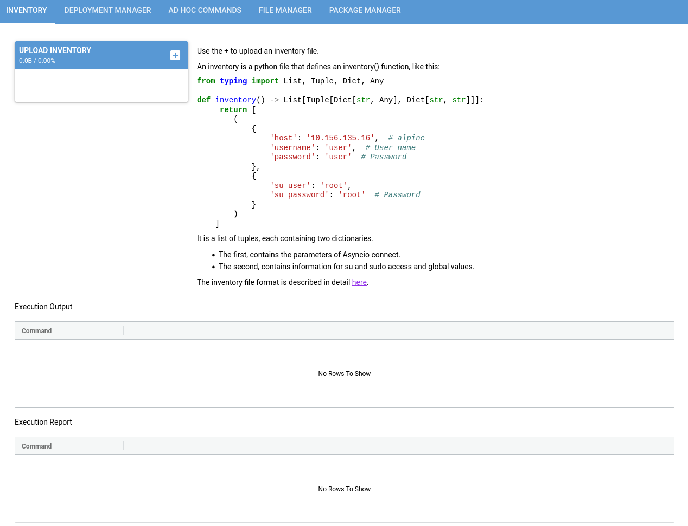
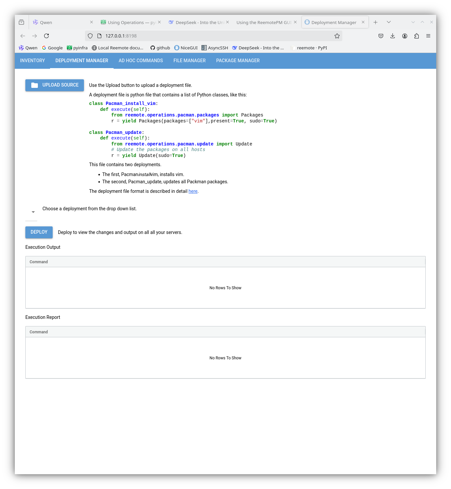
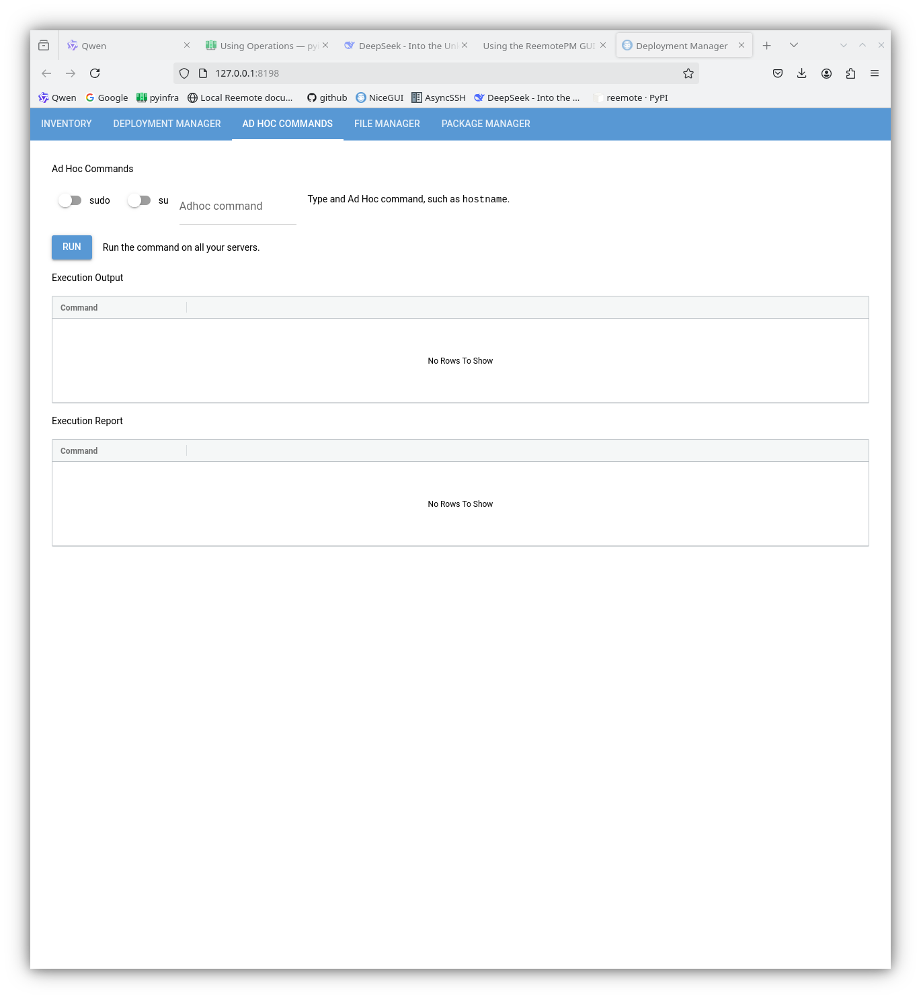
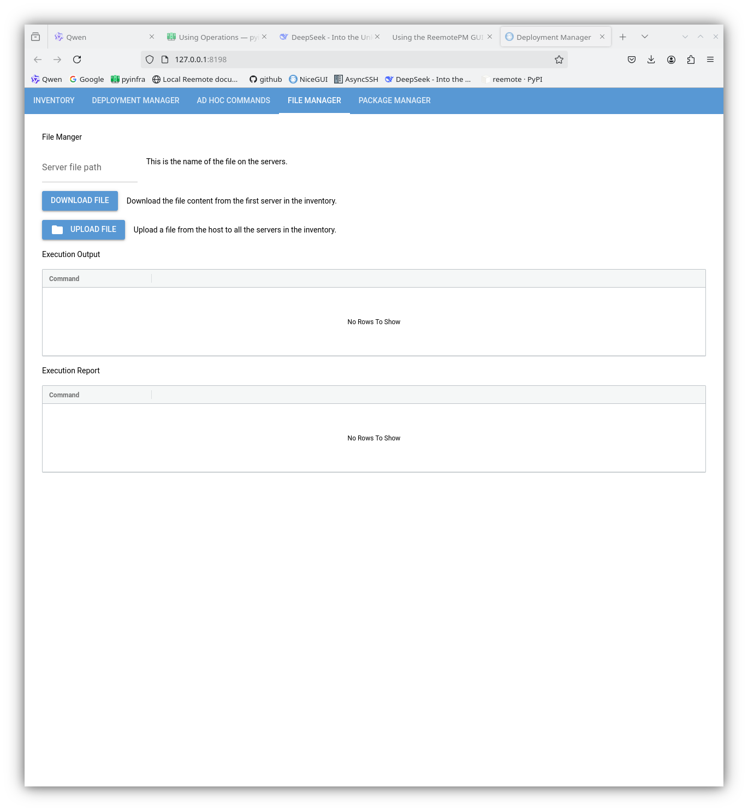
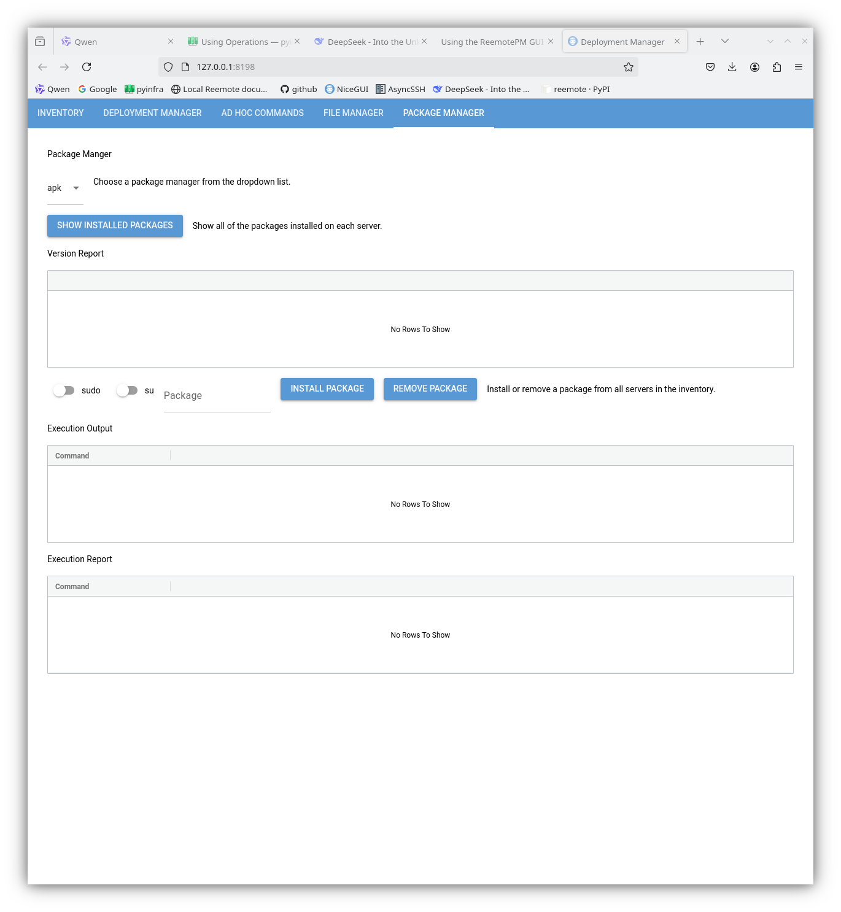

Using the Reemote GUI
=====================

Starting the GUI
----------------

The Reemote Package Manager GUI presents an overview of all of the packages installed on your servers.

.. code-block:: bash

    reemotecontrol

The command starts a new browser window.

Inventory
---------

Use the inventory page to upload an inventory.

Deployment Manager
------------------

Start a deployment from the deployment manager.

Ad-hoc commands
---------------

Perform an Ad-hoc command on all your servers.

File Manger
-----------

Upload and download files on all your servers.

Package Manager
---------------

View package versions and update packages on all your servers.