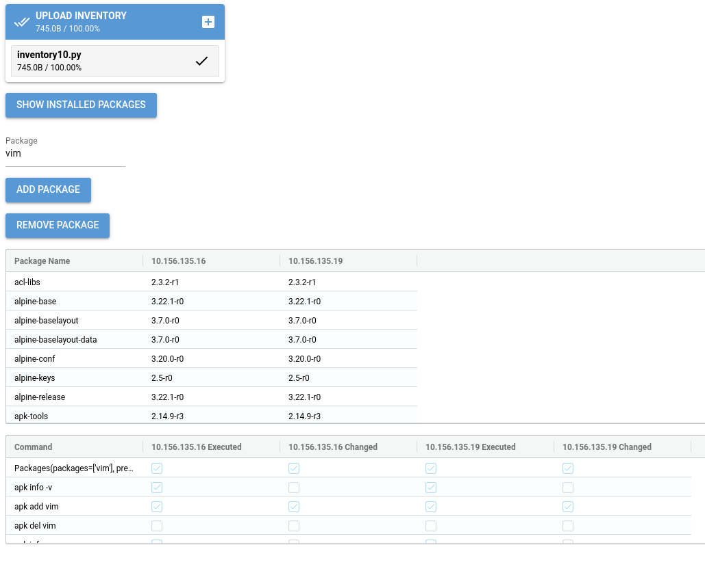

Reemote Documentation
=====================

Reemote is a Python API for task automation, configuration management and application deployment.
You can use Reemote to install and configure software on multiple servers.

This example manages apk package versions on all servers in an inventory.

.. toctree::
   :maxdepth: 2
   :caption: Contents:

   installation
   examples/examples
   inventory
   deployment
   gui/using_the_reemote_gui
   using_the_reemote_cli
   tutorial
   files
   facts_and_operations
   commands
   operations
   facts
   deployments
   callbacks
   utilities

