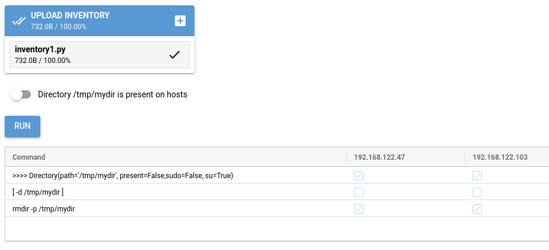

Reemote documentation
=====================

Reemote is a Python API for task automation, configuration management and application deployment.

You can use Reemote to install and configure software on multiple servers.
You can do anything you could do in Ansible, only in Python, and with a GUI !

This example deletes a directory on all the servers in an inventory.

For more information about this example see :ref:`gui-example`.

.. toctree::
   :maxdepth: 2
   :caption: Contents:

   installation
   gettingstarted
   inventory
   usingthecli
   operations