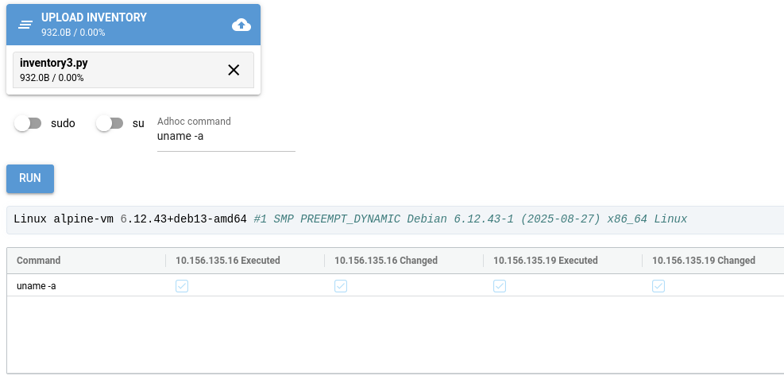

Using the ReemoteAC GUI
=======================

The Reemote Ad Hoc Controller
-----------------------------

The Reemote Adhoc Controller GUI presents a command line for your servers.

.. code-block:: bash

    reemoteac

The command starts a new browser window.

The GUI presents:

* An inventory file picker
* Button to initiate a command on all hosts
* The stdout of the command on the first host
* Reemote execution results