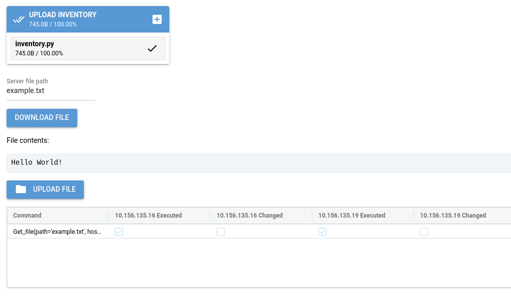

Using the ReemoteFM GUI
=======================

The Reemote File Manager
------------------------

The Reemote File Manager GUI can be used to upload files to, and download files from, your servers.

.. code-block:: bash

    reemotefm

The command starts a new browser window.

The GUI presents:

* An inventory file picker
* The server file path
* A button to download the file from the server
* The file content
* A local file picker for uploading a file to the server
* Reemote execution results