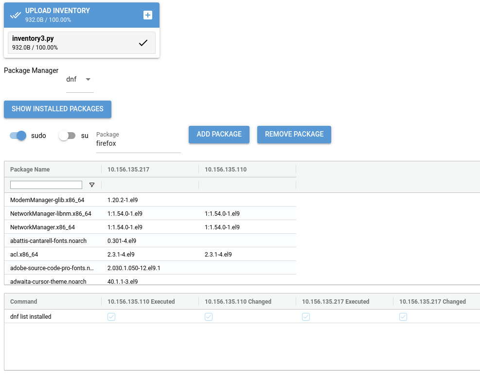

Using the ReemotePM GUI
=======================

The Reemote Package Manager GUI presents an overview of all of the packages installed on your servers.

The command starts a new browser window.

.. code-block:: bash

    reemotepm

The GUI presents:

* An inventory file picker
* A drop down to select the package manager (apk, apt, pip, dnf etc.)
* A button to show all installed packages
* Buttons to add a package, using the appropriate package manager
* A list of installed packages with versions
* Reemote execution results